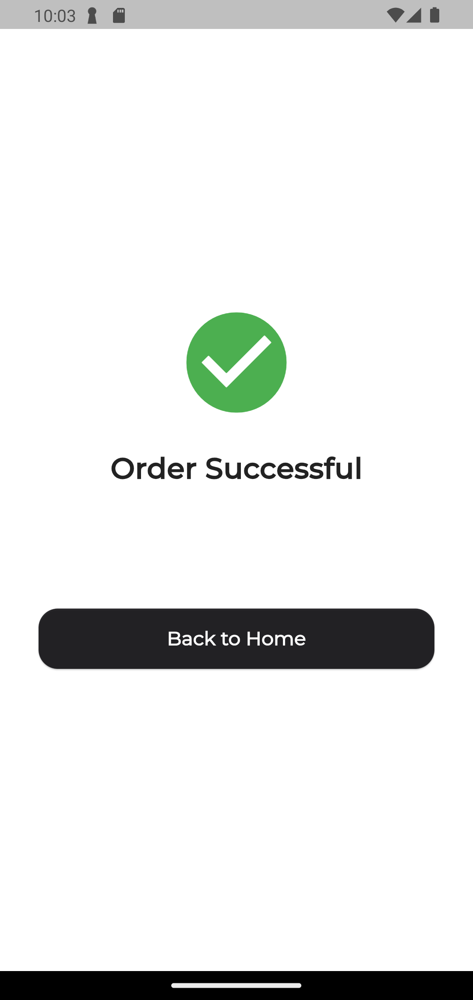

# MKP Fake e-commerce

Flutter project to complete assessment from PT. Mitra Kasih Perkasa

## Description

This project is a simple e-commerce application that has the following features:

- User authentication
- Product listing
- Product detail
- Add to cart
- Cart listing
- Checkout

## Tech Stack

- [Flutter](https://flutter.dev/) - Base framework for building the application
- [Dio](https://pub.dev/packages/dio) - HTTP client for making API requests
- [Riverpod](https://pub.dev/packages/riverpod) - State management library

## Screenshots

|                    Login Page                     |                   Product List Page                   |
|:-------------------------------------------------:|:-----------------------------------------------------:|
|           |        |
|                Product Detail Page                |                Order Confirmation Page                |
|  |  |
|                Order Success Page                 |
|   |